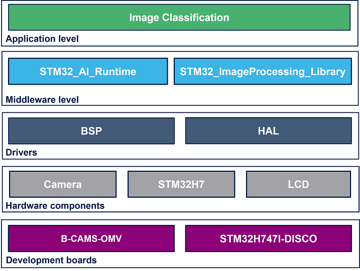
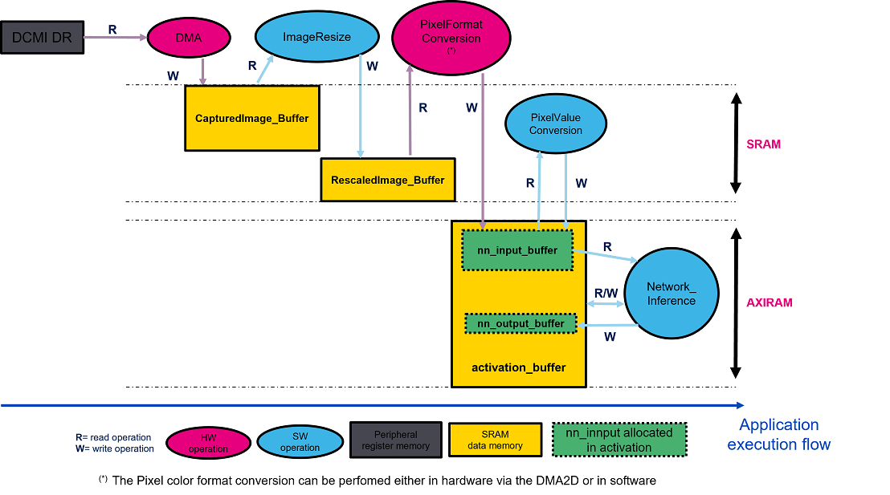

# __Image classification getting started - STM32H747I-DISCO__

The purpose of this package is to enable image classification application on a STM32 board.

This project provides an STM32 microcontroller embedded real time environment to execute [X-CUBE-AI](https://www.st.com/en/embedded-software/x-cube-ai.html) generated models targeting image classification applications.


### __Directory contents__

This repository is structured as follows:

| Directory                                                              | Content                                                   |
|:---------------------------------------------------------------------- |:--------------------------------------------------------- |
| Application\\<STM32_Board_Name>\STM32CubeIDE              | cubeIDE project files; only IDE files related             |
| Application\\<STM32_Board_Name>\Inc                       | Application include files                                 |
| Application\\<STM32_Board_Name>\Src                       | Application source files                                  |
| Application\Network\\*                                                 | *Place holder* for AI C-model; files generated by STM32Cube.AI  |
| Drivers\CMSIS                                                          | CMSIS Drivers                                             |
| Drivers\BSP                                                            | Board Support Package and Drivers                         |
| Drivers\STM32XXxx_HAL_Driver                                           | Hardware Abstraction Layer for STM32XXxx family products  |
| Middlewares\ST\STM32_AI_Runtime                                        | *Place holder* for AI runtime library                     |
| Middlewares\ST\STM32_ImageProcessing_Library                           | Usual image processing functions                          |
| Middlewares\Utilities\Fonts                                            | API to manage the fonts                                   |
| Middlewares\Utilities\lcd                                              | API to manage the lcd screen                              |

## __Before you start__

### __Hardware and Software environment__

In order to run this image classification application examples you need to have the following hardware:

- [STM32H747I-DISCO](https://www.st.com/en/product/stm32h747i-disco) discovery board
- [B-CAMS-OMV](https://www.st.com/en/product/b-cams-omv) camera bundle

Only this hardware is supported for now

### __Tools installations__

This getting started needs [STM32CubeIDE](https://www.st.com/content/st_com/en/products/development-tools/software-development-tools/stm32-software-development-tools/stm32-ides/stm32cubeide.html) as well as [X-CUBE-AI](https://www.st.com/en/embedded-software/x-cube-ai.html) `v7.3.0`


You can find the info to install the tools in the parents [README](../../../../../image_classification/deployment/README_STM32H7.md) of the deployment part and the general [README](../../../../../README.md) of the model zoo.


## __Deployment__

### __Generate C code from tflite file__

This repo does not provide the AI C-model generated by X-CUBE-AI.

The user needs to generate the AI C-model.

It is directly generated by the deployment script of the model zoo.

### __Build and deploy__

You should use the deploy.py script to automatically build and deploy the program on the target (if the hardware is connected).

After the deployment script has been launched once, you can launch the `Application\STM32H747I-DISCO\STM32CubeIDE\.project` with STM32CubeIDE. With the IDE you can modify, build and deploy on the target.

## __Getting started deep dive__

The purpose of this package is to enable image classification application on a STM32 board. 

This package also provides a feature-rich image processing library ([STM32_ImageProcessing_Library](../../Middlewares/ST/STM32_ImageProcessing_Library/) software component).



### __Processing workflow__

The software executes an image classification on each image captured by the camera. The framerate depends on each step of the processing workflow. 


Captured_image: image from the camera

Network_Preprocess - 3 steps:
   -  ImageResize: rescale the image to fit the resolution needed by the network
   -  PixelFormatConversion: convert image format (usually RGB565) to fit the network color channels (RGB888 or Grayscale)
   -  PixelValueConversion: convert to pixel type used by the network (uint8 or int8)

HxWxC: Height, Width and Number of color channels, format defined by the neural network

Network_Inference: call AI C-model network

Network_Postprocess: call Output_Dequantize to convert the output type (only float32 for now)

### __Model memory configuration__

Two different types of memory spaces are needed to run a neural network: 
- flash memory (read-only, slow memory), it is where the weights of the model are stored
- RAM memory (read/write, fast memory), used for the activation buffer in which the calculations take place
In the embedded devices such as STM32 MCUs, the memory is quite limited, because the need for memory in embedded applications is usually small. Computer vision on the edge is an exception and is a memory intensive application. Fortunately, the high-performance STM32 MCUs allow for the use of external memory. The STM32H747I-DISCO board include external memory chips to complement the internal memory of the STM32. 
Internal memory: 
- 2 MB flash
- 1 MB RAM
External memory: 
- 128 MB flash
- 32 MB RAM
Still the external memory is slower than the internal memory, for this reason the internal memory needs to be prioritize over the external memory. 
The Python script of the ModelZoo will automatically optimize the memory usage to put the weights in internal flash and the activation buffer in internal RAM. If there is not enough space available in internal memory, the weights and/or the activation buffer will be split to be dispatched between the internal and the external memories. 

### __Memory layout__

The application software uses different buffers. The following diagram describes how there are used and which functions interact with it, in case the activation buffer fits into internal memory. 




### __Model configuration__

The `'<getting-start-install-dir>/Application/STM32H747I-DISCO/Inc/CM7/ai_model_config.h'` file contains configuration information.

This file is generated by the deploy.py script.

The number of output class for the model:

```C
#define NB_CLASSES          (5)
```

The dimension of the model input tensor:

```C
#define INPUT_HEIGHT        (128)
#define INPUT_WIDTH         (128)
#define INPUT_CHANNELS      (3)
```

A table containing the list of the labels for the output classes:

```C
#define CLASSES_TABLE const char* classes_table[NB_CLASSES] = {\
   "daisy" ,   "dandelion" ,   "roses" ,   "sunflowers" ,   "tulips"}\
```

The type of resizing algorithm that should be used by the preprocessing stage:

```C
#define NO_RESIZE                   (0)
#define INTERPOLATION_NEAREST       (1)

#define PP_RESIZING_ALGO       INTERPOLATION_NEAREST
```
 In the version V1.0 of the package, only the nearest neighbor algorithm is supported.

Input frame aspect ratio algorithms:
```C
#define ASPECT_RATIO_FIT            0
#define ASPECT_RATIO_CROP         1
#define ASPECT_RATIO_PADDING      2

#define ASPECT_RATIO_MODE ASPECT_RATIO_FIT
```

The pixel color format that is expected by the neural network model: 

```C
#define RGB_FORMAT        (1)
#define BGR_FORMAT        (2)
#define GRAYSCALE_FORMAT  (3)
#define PP_COLOR_MODE    RGB_FORMAT
```

Data format supported for the input and/or the output of the neural network model: 
```C
#define UINT8_FORMAT     (1)
#define INT8_FORMAT      (2)
#define FLOAT32_FORMAT   (3)
```

Data format that is expected by the input layer of the quantized neural network model (only UINT8 and INT8 formats are supported in V1.0):
```C
#define QUANT_INPUT_TYPE    INT8_FORMAT
```

Data format that is provided by the output layer of the quantized neural network model (only FLOAT32 format is supported in V1.0):
```C
#define QUANT_OUTPUT_TYPE    FLOAT32_FORMAT
```


The rest of the model details will be embedded in the `.c` and `.h` files generated by the tool [X-CUBE-AI](https://www.st.com/en/embedded-software/x-cube-ai.html). 

### __Image processing__

The frame captured by the camera is in a standard video format. As the neural network needs to receive a square-shaped image as input, three solutions are provided to reshape the captured frame before running the inference
- ASPECT_RATIO_FIT: the frame is compacted to fit into a square with a side equal to the height of the captured frame. The aspect ratio is modified. 


- ASPECT_RATIO_CROP: the frame is cropped to fit into a square with a side equal to the height of the captured frame. The aspect ratio remains but some data is lost on each side of the image. 


- ASPECT_RATIO_PADDING: the frame is filled with black borders to fit into a square with a side equal to the width of the captured frame. The aspect ratio remains. 


## __Limitations__

- Supports only Cube-AI from v7.3.0 to latest version.
- Supports only the STM32H747I-DISCO board with B-CAMS-OMV camera module.
- Supports only neural network model whom size fits in SoC internal memory
- Supports only 8-bits quantized model
- Input layer of the quantized model supports only data in UINT8 or INT8 format
- Output layer of the quantized model provides data in only FLOAT32 format
- Manageable through STM32CubeIDE, IAR and Keil (open, modification, debug)
