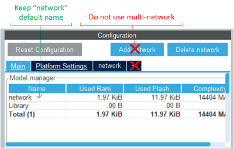

# __Sensing and Audio Getting Started Package__

This project provides an STM32 Microcontroler embedded real time environement to execute [X-CUBE-AI](https://www.st.com/en/embedded-software/x-cube-ai.html) generated model targetting sensing and audio applications

## __Keywords__

Getting Start, Model Zoo, Sensing, Audio, X-CUBE-AI

## __Hardware and Software environment__

This example runs on [B-U585I-IOT02A](https://www.st.com/en/evaluation-tools/b-u585i-iot02a.html)

### __STM32CubeIDE tool installation__

The STM32CubeIDE tool is required to manage an STM32 AI C-project. It allows to install in a simple way, the requested tools to compile, build and flash a firmware on a STM32 development board.

Download [STM32CubeIDE](https://www.st.com/content/st_com/en/products/development-tools/software-development-tools/stm32-software-development-tools/stm32-ides/stm32cubeide.html), extract the package and execute the installer.

### __X-CUBE-AI tool installation__

[X-CUBE-AI](https://www.st.com/en/embedded-software/x-cube-ai.html) is an STM32Cube Expansion Package, which is part of the STM32Cube.AI ecosystem. It extends STM32CubeMX capabilities with automatic conversion of pretrained artificial intelligence algorithms, including neural network and classical machine learning models. It integrates also a generated optimized library into the user's project.

This software is tested with [X-CUBE-AI](https://www.st.com/en/embedded-software/x-cube-ai.html) `v8.0.0`. It is advised that the user uses the same version to avoid any potential compatibility issues.

The pack can be installed through [STM32CubeMX](https://www.st.com/content/st_com/en/products/development-tools/software-development-tools/stm32-software-development-tools/stm32-configurators-and-code-generators/stm32cubemx.html) through the  *STM32CubeExpansion* pack mechanism.

### __Installation of the X-CUBE-AI runtime__

Please copy

```bash
<X_CUBE_AI-directory-path>
  \- Middlewares/ST/AI/Inc/*.h
```

into the middleware project directory `'<install-dir>/Middleware/STM32_AI_Library/Inc'`

and

```bash
<X_CUBE_AI-directory-path>
  \- Middlewares/ST/AI/Lib/NetworkRuntime800_CM33_GCC.a
```

into the middleware project directory `'<install-dir>/Middleware/STM32_AI_Library/Lib'`

### __Generation and Installation of the X-CUBE-AI model__

This package does not provides the AI model generated by [X-CUBE-AI](https://www.st.com/en/embedded-software/x-cube-ai.html).
The user needs to generate the AI model either using the *GUI* (*G*raphical *U*ser *I*nterface) or the *CLI* (*C*ommand *L*ine *I*nterface).

The package does not support multiple network, hence please make sure to generate a unique AI network with its default name *network*:

With the *GUI*



With the *CLI*, just do *not* use the option ```-n/--name```

After generating the network, please copy the resulting following files:

```bash
<output-directory-path>
  \- App/network*
```

into the project directory `'<install-dir>/Projects/Common/X-CUBE-AI/App'`

### __Configuration__

#### __AED example__

The example provided below is based on Yamnet 256 model provided in the ST model zoo.

First describe the number and the nature of the model output and its type:

```C
#define CTRL_X_CUBE_AI_MODE_NB_OUTPUT          (1U) /* or (2U)*/
#define CTRL_X_CUBE_AI_MODE_OUTPUT_1           (CTRL_AI_CLASS_DISTRIBUTION)
#define CTRL_AI_CLASS_DISTRIBUTION (1U)
```

Then you describe the class indexes and their labels in this way:

```C
#define CTRL_X_CUBE_AI_MODE_CLASS_NUMBER       (10U)
#define CTRL_X_CUBE_AI_MODE_CLASS_LIST         {"chainsaw","clock_tick","crackling_fire","crying_baby","dog","helicopter","rain","rooster","sea_waves","sneezing"}
```

Now you can select audio preprocessing type:

```C
#define CTRL_X_CUBE_AI_PREPROC                 (CTRL_AI_SPECTROGRAM_LOG_MEL)
```

For spectrogram log mel pre processing you need to specify the various parameters of the patch processing:


The parameters are:

```C
#define CTRL_X_CUBE_AI_SPECTROGRAM_NMEL          (64U)
#define CTRL_X_CUBE_AI_SPECTROGRAM_COL           (96U)
#define CTRL_X_CUBE_AI_SPECTROGRAM_HOP_LENGTH    (160U)
#define CTRL_X_CUBE_AI_SPECTROGRAM_NFFT          (512U)
#define CTRL_X_CUBE_AI_SPECTROGRAM_WINDOW_LENGTH (400U)
#define CTRL_X_CUBE_AI_SPECTROGRAM_NORMALIZE     (0U) // (1U)
#define CTRL_X_CUBE_AI_SPECTROGRAM_FORMULA       (MEL_HTK) //MEL_SLANEY
#define CTRL_X_CUBE_AI_SPECTROGRAM_FMIN          (125U)
#define CTRL_X_CUBE_AI_SPECTROGRAM_FMAX          (7500U)
#define CTRL_X_CUBE_AI_SPECTROGRAM_TYPE          (SPECTRUM_TYPE_MAGNITUDE)
#define CTRL_X_CUBE_AI_SPECTROGRAM_LOG_FORMULA   (LOGMELSPECTROGRAM_SCALE_LOG)
```

For optimizing Mel Spectrogram computational performances the following *L*ook *U*p *T*ables (*LUT*) needs to be provided:

* the smoothing window to be applied before the Fast Fourrier transform , this is typically an Hanning window the table is named with the following defines:

```C
#define CTRL_X_CUBE_AI_SPECTROGRAM_WIN           (user_win)
```

* the Mel filters taps. Only non nul taps are provided in a concatenated form, which is why start and stop indexes are provided in separated tables

```C
#define CTRL_X_CUBE_AI_SPECTROGRAM_MEL_LUT       (user_melFilterLut)
#define CTRL_X_CUBE_AI_SPECTROGRAM_MEL_START_IDX (user_melFilterStartIndices)
#define CTRL_X_CUBE_AI_SPECTROGRAM_MEL_STOP_IDX  (user_melFilterStopIndices)
```

The *LUT*s can be generated by the C-code provided in `'<install-dir>/Projects/Common/dpu/PreProc_DPU.c'`
by uncomnenting the following define:

```C
#define MFCC_GEN_LUT
```

More typically, they will directlty be generated by the ST model zoo deployment script.

These *LUT*s are defined in `'<install-dir>/Projects/Common/dpu/user_mel_tables.c'` and declared in `'<install-dir>/Projects/Common/dpu/user_mel_tables.h'`

You will now describe the digital microphone that will connect to the AI processing chain:

```C
#define CTRL_X_CUBE_AI_SENSOR_TYPE            (COM_TYPE_MIC)
#define CTRL_X_CUBE_AI_SENSOR_ODR             (16000.0F)
#define CTRL_X_CUBE_AI_SENSOR_FS              (112.5F)
```

### __Execution__

The package includes a project executing a controller task that is configurable (as described above) by user through the following header file `'<install-dir>/Projects/Common/dpu/ai_model_config.h'`

The application itself is implemented in :

```bash
<getting-start-install-dir>
  \- /Projects/Common/dpu/*
```

During execution phase the AI model is first loaded and the hardware is set up.

On initialisation, the application loads and checks `X-CUBE-AI` model:

* Api version == `1.2.0` ( `X-CUBE-AI` `7.3.0` & `8.0.0` )
* Input buffers number == `1`
* Outputs buffer number must be less or equal than 2
* Input buffers type : `AI_BUFFER_FMT_TYPE_FLOAT` or `AI_BUFFER_FMT_TYPE_Q` (signed 8 bits)
* Input buffers size is within boundaries (batch < `1`, height < `100`, width <`100`, channels <`100`)
* Output buffers type : `AI_BUFFER_FMT_TYPE_FLOAT`
* Ouput buffers size is within boundaries (batch < `1`, height < `100`, width <`100`, channels <`100`)

A sensor among the available ones is configured.

When data buffer is ready

* If sensor type is accelerometer, calls built-in pre-processing function
* Calls `X-CUBE-AI` model


## __History__

### __V0.1 POC  Initial version__

* Added audio preprocessing
* Added support for Audio Event Detection (AED)
* Added patch processing for AED
* Limited to CubeIDE / arm gcc toolchain
